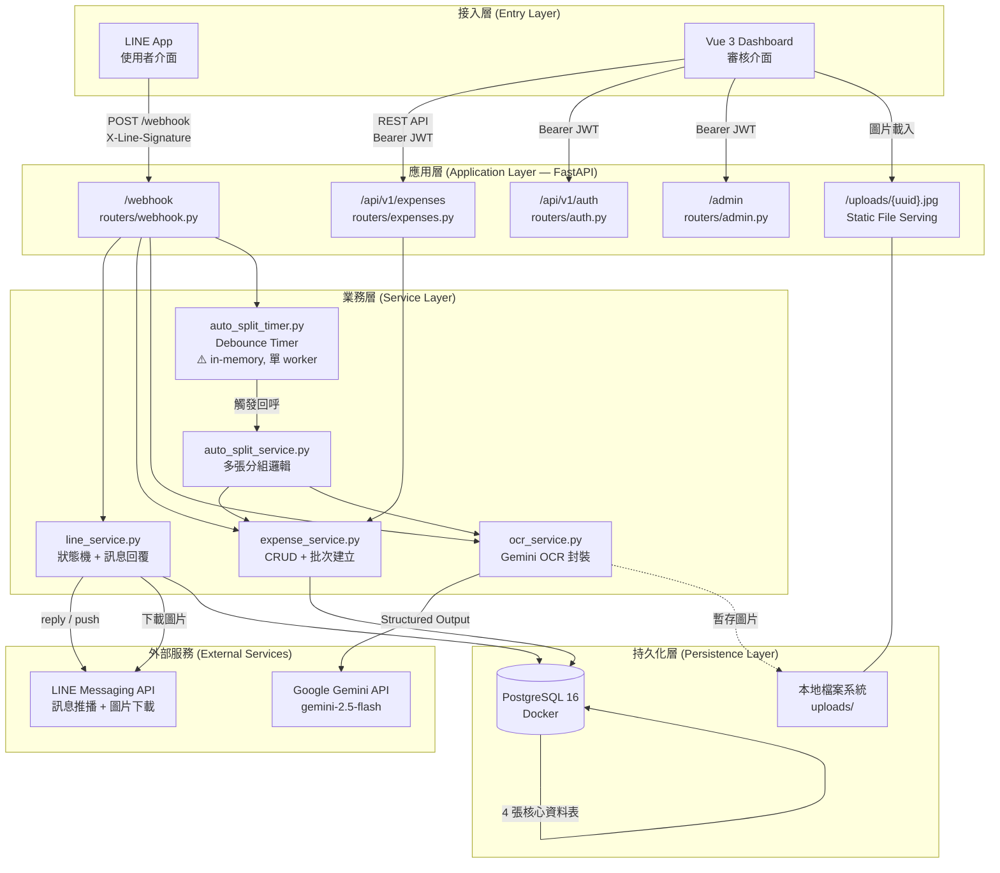
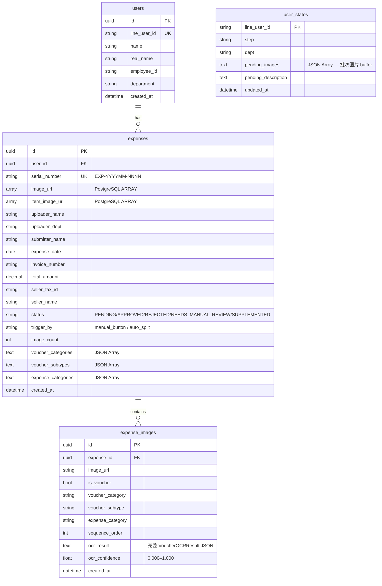
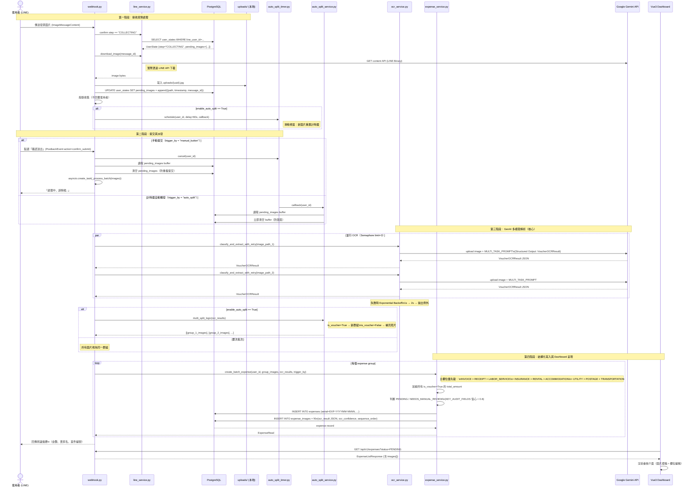
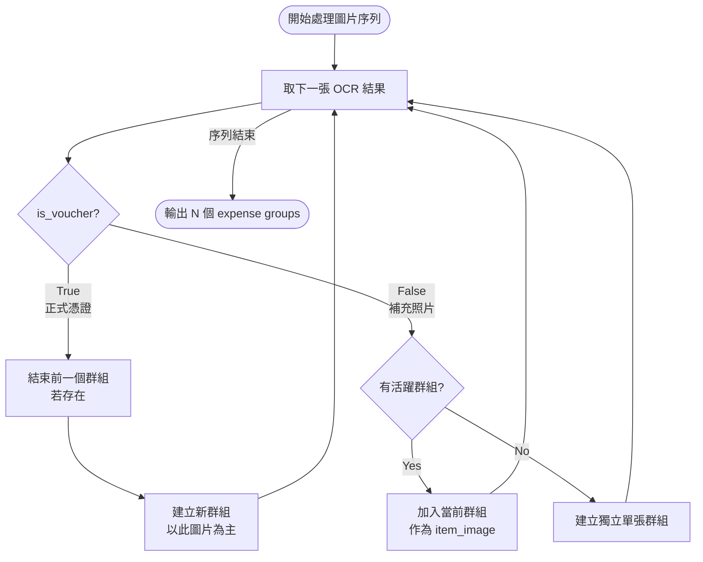
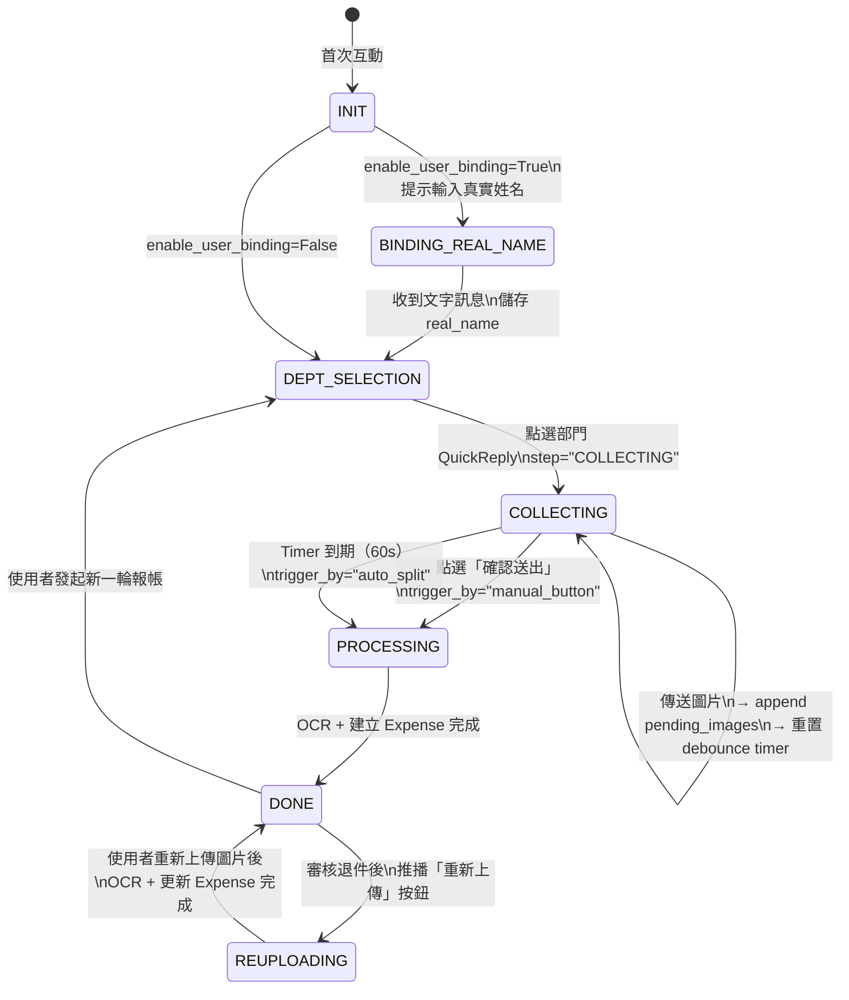
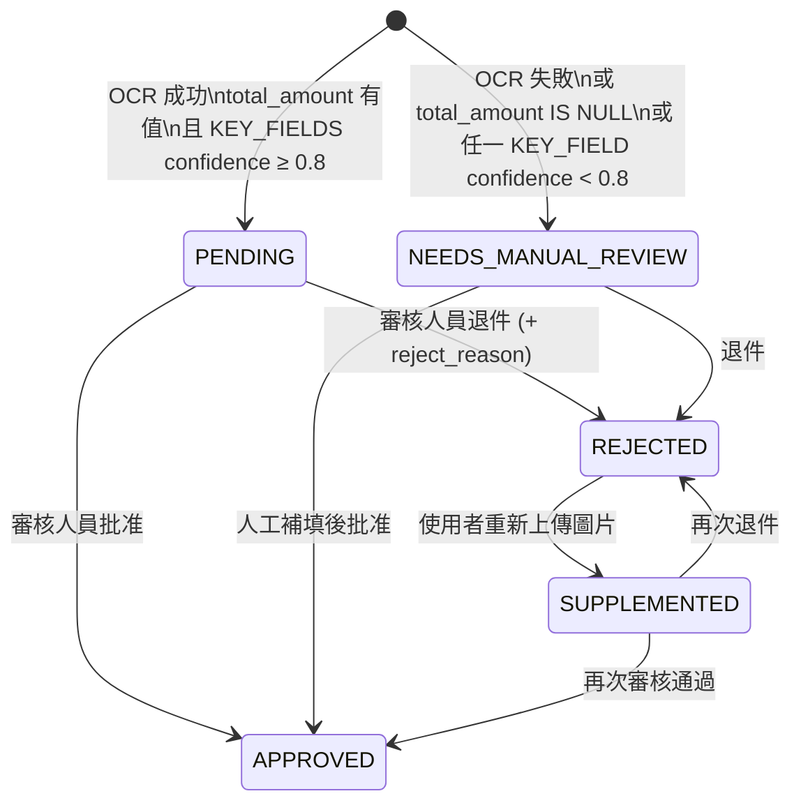

# AcctAssist 技術架構與資料流文檔

> **版本**：v1.0 ｜ **更新日期**：2026-04-16  
> **適用對象**：後端維護工程師、新成員、PM  
> **文件目的**：描述系統各元件協作關係，以及一筆發票資料從上傳到歸檔的完整生命週期。

---

## 目錄

1. [系統整體技術架構](#1-系統整體技術架構)
2. [單筆資料生命週期](#2-單筆資料生命週期)
3. [GenAI 多模態解析詳解](#3-genai-多模態解析詳解)
4. [Auto-Split 分組演算法](#4-auto-split-分組演算法)
5. [狀態機與關鍵欄位速查](#5-狀態機與關鍵欄位速查)

---

## 1. 系統整體技術架構

### 1.1 高層元件協作圖



### 1.2 四張核心資料表關係



### 1.3 兩種任務派發機制對比

| 機制 | 觸發條件 | 程式路徑 | `trigger_by` 值 | 備註 |
|------|---------|---------|----------------|------|
| **手動點擊提交** | 使用者點選「確認送出」Flex Button | `PostbackEvent` → `cancel()` timer → `create_task(_process_batch())` | `"manual_button"` | 即時取消 debounce |
| **計時器自動觸發** | 最後一張圖片後 N 秒無動作（預設 60s） | `schedule()` → `asyncio.sleep()` → `auto_split_service.process()` | `"auto_split"` | 需 `enable_auto_split=True`；僅支援單 worker |

---

## 2. 單筆資料生命週期

### 完整序列圖



---

## 3. GenAI 多模態解析詳解

### 3.1 Prompt 策略：三步驟推理鏈

`ocr_service.py` 使用單一 `MULTI_TASK_PROMPT`，要求 Gemini 依序完成三個任務：

#### Step 1 — Scene Reasoning（場景推理）

> 目標：在提取任何欄位之前，先透過視覺線索建立整體理解。

Gemini 分析的視覺要素：
- 商店名稱與 Logo 辨識
- 文件格式與排版特徵（電子發票格式 vs 手寫收據）
- 印章顏色與位置（免稅印章、統一發票專用章）
- 紙張特徵與質感推斷

輸出存入 `scene_reasoning: str`，作為後續提取的語義背景。

#### Step 2 — Field Extraction & Rationalization（欄位提取與合理化）

> 目標：提取所有可見欄位，並以「會計常識」補推不可見欄位。

**補推範例：**
- 若 `net_amount` + `tax_amount` 可見但 `total_amount` 不清晰 → 計算推論，標記 `total_amount` 進入 `inferred_fields[]`
- 民國年轉西元年（e.g., 114/04/16 → 2025-04-16）
- CREDIT_NOTE 金額強制轉為負數（後端 post-process）

#### Step 3 — Confidence Scoring & Audit Review（信心評分與審計）

> 目標：為每個關鍵欄位提供信心分數，並生成人工審核建議。

每個欄位有對應的 `{field}_confidence: float (0.0–1.0)` 分數：

```
invoice_number_confidence    → 發票號碼辨識可信度
seller_tax_id_confidence     → 統一編號辨識可信度
total_amount_confidence      → 金額辨識可信度
id_number_confidence         → 勞務所得身分證字號
```

**信心評分路由規則：**

```
KEY_AUDIT_FIELDS = {invoice_number, seller_tax_id, total_amount, id_number}
KEY_FIELD_THRESHOLD = 0.8

IF 任一 KEY_AUDIT_FIELD.confidence < 0.8
    → status = NEEDS_MANUAL_REVIEW
ELSE IF total_amount IS NULL
    → status = NEEDS_MANUAL_REVIEW
ELSE
    → status = PENDING
```

### 3.2 語義歸類體系

Gemini 回傳的語義分類欄位形成三層巢狀結構：

```
is_voucher (bool)
    └── voucher_category (10 種)
            └── voucher_subtype (細分)
                    expense_category (消費類別，獨立維度)
```

#### 憑證類別（voucher_category）與細分（voucher_subtype）

| voucher_category | voucher_subtype 範例 | 語義觸發條件 |
|-----------------|---------------------|------------|
| `INVOICE` | `ELECTRONIC`, `PAPER`, `EXEMPT_INVOICE` | 有統一編號格式、發票專用章 |
| `RECEIPT` | `WITH_STAMP`, `WITHOUT_STAMP` | 收銀機收據、手寫收據、無稅務格式 |
| `TRANSPORTATION` | `HSR_TICKET`, `TAXI`, `PARKING`, `FUEL`, `TOLL_ETC`, `TRAIN`, `BUS` | 交通工具票根、油站收據 |
| `LABOR_SERVICE` | — | 有身分證字號、勞務報酬單 |
| `INSURANCE` | `WORK_INJURY`, `LIFE`, `VEHICLE` | 保單、保費收據 |
| `UTILITY` | `ELECTRICITY`, `WATER`, `GAS`, `TELECOM` | 公用事業帳單 |
| `RENTAL` | `OFFICE`, `VENUE`, `EQUIPMENT` | 房租、場地費用 |
| `ACCOMMODATION` | — | 飯店住宿收據、訂房確認單 |
| `POSTAGE` | `EXPRESS`, `REGISTERED` | 郵資、快遞費用 |
| `CREDIT_NOTE` | — | 折讓單（金額強制為負） |

#### 消費類別（expense_category）

| expense_category | 說明 |
|-----------------|------|
| `MEAL` | 餐飲消費（從 RECEIPT 之店名/品項推斷） |
| `TRANSPORTATION` | 交通費（高鐵票、計程車、停車費） |
| `STATIONERY` | 文具辦公用品 |
| `INSURANCE` | 保險費 |
| `UTILITY` | 水電瓦斯費 |
| `ACCOMMODATION` | 住宿費 |
| `VENUE_RENTAL` | 場地租借費 |
| `OFFICE_RENTAL` | 辦公室租金 |
| `LABOR` | 勞務報酬 |
| `POSTAGE` | 郵資快遞 |

> **推論示例**：RECEIPT 類型圖片，若 `seller_name` 包含「全家」、「7-11」，Gemini 會將 `expense_category` 設為 `MEAL` 或 `STATIONERY`，依品項內容決定。

### 3.3 技術實作亮點

| 亮點 | 實作細節 |
|------|---------|
| **Structured Output** | `response_schema=VoucherOCRResult`，直接對應 Pydantic 模型，零 JSON 解析錯誤 |
| **並發控制** | `asyncio.Semaphore(3)`，避免 Gemini API rate limit 429 |
| **重試機制** | Exponential backoff：1s → 2s，最多 3 次，失敗後回傳 `success=False` |
| **補推透明度** | `inferred_fields: list[str]` 明確標記所有推斷欄位，審計可追溯 |
| **後處理修正** | CREDIT_NOTE 金額強制負數（Gemini 有時回傳正值） |

---

## 4. Auto-Split 分組演算法

### 4.1 設計目標

當使用者一次上傳多張圖片（如：三張發票 + 各自的明細照片）時，系統自動判斷應建立幾筆報帳記錄。

### 4.2 分組邏輯（multi_split_logic）



### 4.3 範例說明

| 輸入序列 | 分組結果 |
|---------|---------|
| `[INVOICE, photo, photo]` | 1 筆：INVOICE + 2 張 item_image |
| `[INVOICE, photo, INVOICE, photo]` | 2 筆：各自含 1 張 item_image |
| `[photo, INVOICE]` | 2 筆：photo 獨立，INVOICE 獨立 |
| `[RECEIPT, RECEIPT]` | 2 筆：各自獨立 |

### 4.4 部署限制

> ⚠️ **重要**：`auto_split_timer.py` 使用 Python 字典（`_timers: dict[str, asyncio.Task]`）管理計時器。此為**程式記憶體內**狀態，不持久化至資料庫。
>
> **限制**：`enable_auto_split=True` 時，**必須使用單 worker 部署**：
> ```bash
> uvicorn main:app --workers 1
> ```
> 多 worker 或多容器環境下，計時器狀態不跨 process 同步，會導致 timer 遺失或重複觸發。

---

## 5. 狀態機與關鍵欄位速查

### 5.1 LINE 對話狀態機



### 5.2 Expense 狀態流轉



### 5.3 快速設定查詢

| 功能開關 | 環境變數 / 設定 | 預設值 | 說明 |
|---------|--------------|--------|------|
| 自動提交（計時器） | `ENABLE_AUTO_SPLIT` | `False` | True 時需單 worker |
| Debounce 時長 | `AUTO_SPLIT_DEBOUNCE_SECONDS` | `60` | 單位：秒 |
| 真實姓名綁定 | `ENABLE_USER_BINDING` | `True` | 首次互動強制填寫 |
| 退件 LINE 推播 | `ENABLE_LINE_PUSH_REJECT` | `True` | 關閉後靜默退件 |
| Gemini 模型 | `GEMINI_MODEL` | `gemini-2.5-flash` | 可替換為其他版本 |
| 信心閾值 | `KEY_FIELD_THRESHOLD`（程式碼常數） | `0.8` | 需改 `schemas/ocr.py` |

---

*文件由工程團隊維護，如有架構變更請同步更新本文件。*
